<div align="center">


# تِبْيان | Tibyan

**من السؤال إلى المصدر الموثوق — تبيان المسألة بمصدرها ودليلها**

_لا نُنشئ الفتوى، نوصلك إليها._ · We do not create fatwas; we lead you to them.

**[🌐 جرّب الموقع مباشرة](https://tibyan-rain.abrdns.com)** · [English summary](#english-summary) · [التشغيل محليًا](#التشغيل-محليًا) · [سجل التطوير](#dev-history) · [التوثيق والتراخيص](#docs)

فريق **RAIN** — هاكاثون **باذل BATHEL 2026** · تحدي الذكاء الاصطناعي في خدمة المحتوى الإسلامي

</div>

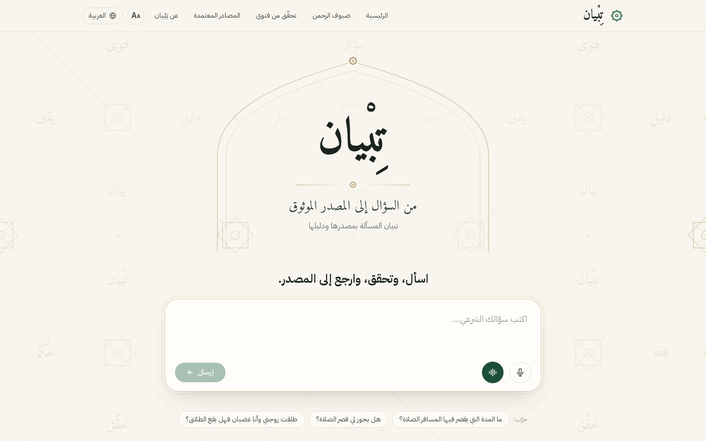

<div dir="rtl">

## الفكرة

تنتشر في وسائل التواصل فتاوى وأقوال منسوبة إلى العلماء بلا مصدر، وكثير منها محرّف أو مقتطع من سياقه. وروبوتات
المحادثة العامة تزيد المشكلة؛ لأنها تولّد أحكامًا شرعية من معرفتها العامة وقد تخترع ما لم يقله أحد.

**تِبْيان ليس روبوتًا يُفتي.** هو طبقة ثقة بين السائل والمصدر الشرعي المعتمد:

1. يفهم السؤال بأي لغة من 11 لغة، كتابةً أو صوتًا.
2. يبحث **فقط** في قائمة بيضاء من المصادر المعتمدة (فتاوى ابن باز وابن عثيمين وموسوعة الأحاديث…).
3. يعرض **النص الحرفي** الذي استند إليه مع رابطه، ويتحقق أن كل جملة في الإجابة مدعومة بذلك النص.
4. إذا لم يجد دليلًا كافيًا **يمتنع**، وإذا كانت المسألة حالة شخصية **يُحيل** إلى جهة رسمية متحقق منها،
   وإذا نقصت معلومة **يستوضح** بدل أن يفترض.

## المزايا

| الميزة                       | ماذا تقدّم                                                                                                                                |
| ---------------------------- | ----------------------------------------------------------------------------------------------------------------------------------------- |
| **إجابة موثّقة بمصدرها**     | خلاصة قصيرة، ثم نص الفتوى الأصلي واسم الشيخ والمجموعة ورابط الفتوى، مع «سلسلة الثقة» التي تشرح خطوات الوصول للإجابة                       |
| **الاستيضاح قبل الإجابة**    | «هل يجوز لي قصر الصلاة؟» ← «هل أنت مسافر أم مقيم؟» ثم إجابة موثقة                                                                         |
| **الإحالة للجهات المختصة**   | المسائل الشخصية (الطلاق، المواريث…) تُحال إلى جهات رسمية تحققنا من مواقعها، كوزارة العدل ومنصة ناجز                                       |
| **الامتناع عند غياب الدليل** | لا «أقرب تخمين»: إن لم توجد فتوى كافية يقول ذلك صراحة                                                                                     |
| **تحقّق من فتوى متداولة**    | الصق رسالة فيها «قال الشيخ…» فيبحث في الفتاوى ويحكم: موجود بنصّه، أو بمعناه، أو يخالف ما في الفتوى، أو لم يُعثر عليه — مع عرض النص الأصلي |
| **ضيوف الرحمن**              | صفحة للحجاج والمعتمرين بأسئلة المناسك الشائعة، بلغتهم                                                                                     |
| **11 لغة**                   | العربية، English، اردو، हिन्दी، বাংলা، Türkçe، Indonesia، Melayu، O‘zbekcha، Қазақша، Hausa — تُكتشف لغة السؤال تلقائيًا ويُجاب بها       |
| **الصوت**                    | سؤال بالميكروفون، و«استمع» لقراءة الإجابة الموثقة، و«محادثة صوتية» كاملة بلا لمس                                                          |
| **الوضع الميسّر**            | خط أكبر وزر ميكروفون كبير وقراءة تلقائية للإجابة، لكبار السن                                                                              |
| **مشاركة كصورة**             | بطاقة أنيقة للإجابة مع رمز QR يفتح المصدر، بدل نشر نص بلا مرجع                                                                            |
| **البحث المباشر**            | إذا لم تكن الإجابة في الفهرس يُبحث في مواقع المصادر المعتمدة نفسها، وتُفهرس الصفحة لمن يسأل بعدك                                          |
| **لوحة الحوكمة**             | إحصاءات ونتائج الأسئلة وفجوات المحتوى، واعتماد المصادر أو تعليقها أو حظرها وإعادة فهرستها، وسجل تدقيق لكل إجراء                           |

### لقطات من الموقع

| إجابة موثقة بمصدرها                                           | استيضاح قبل الإجابة                                       |
| ------------------------------------------------------------- | --------------------------------------------------------- |
| 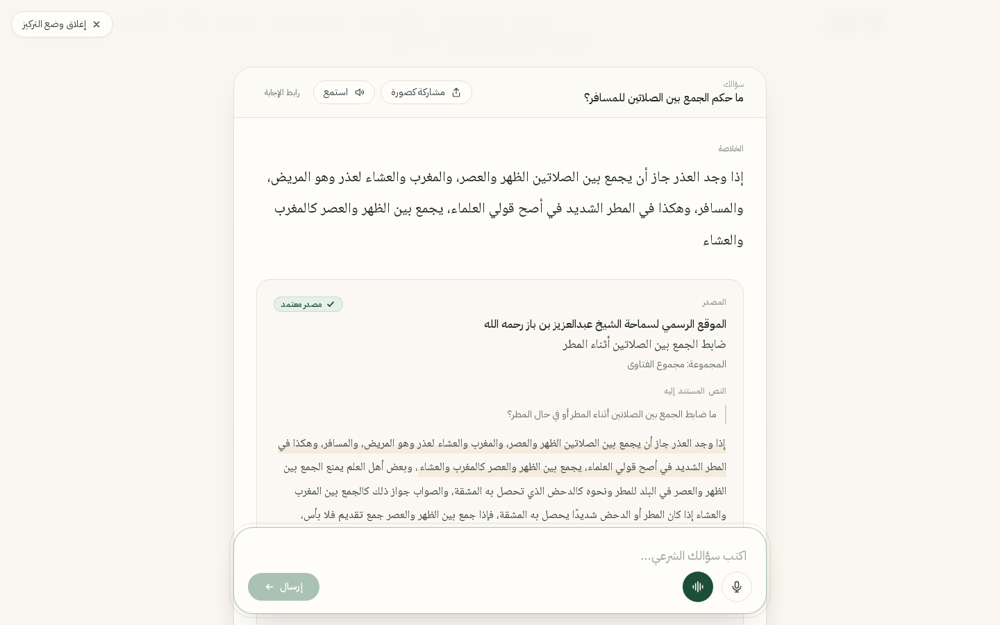        | 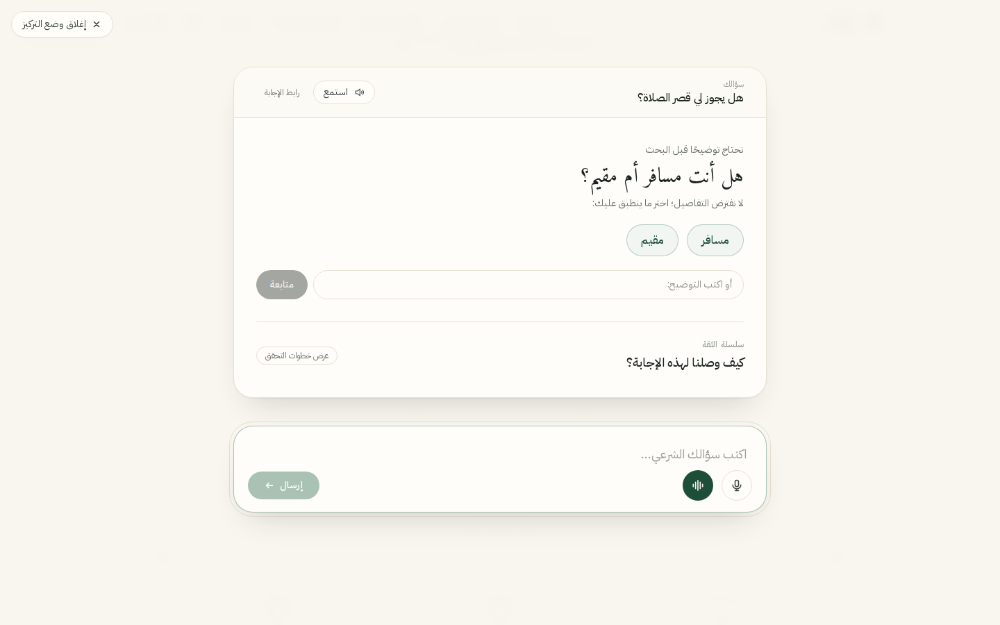 |
| **إحالة المسائل الشخصية لجهة رسمية**                          | **تحقّق من فتوى متداولة (نص محرّف)**                      |
| 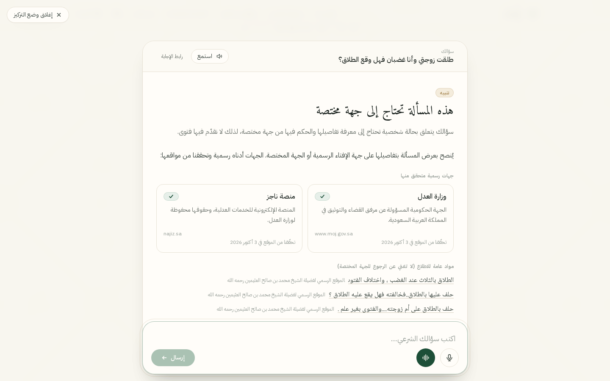          | 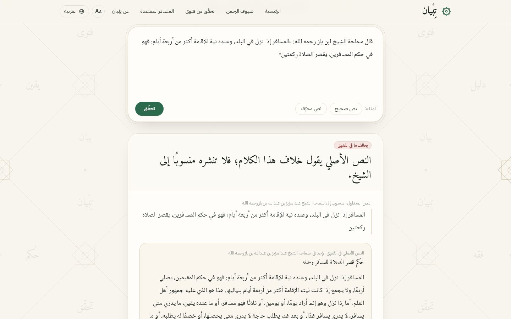 |
| **بطاقة المشاركة مع رمز QR**                                  | **ضيوف الرحمن**                                           |
| 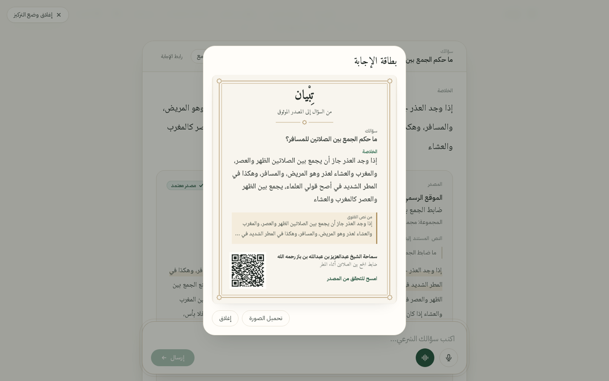 | 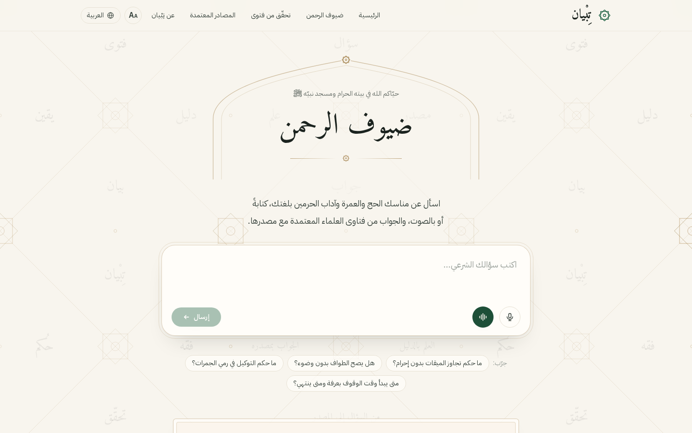      |
| **لوحة الحوكمة**                                              | **الواجهة الإنجليزية**                                    |
| 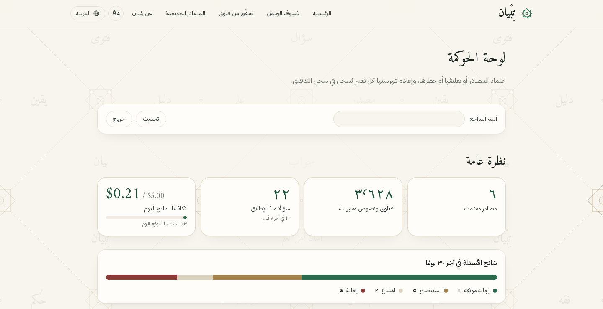        | 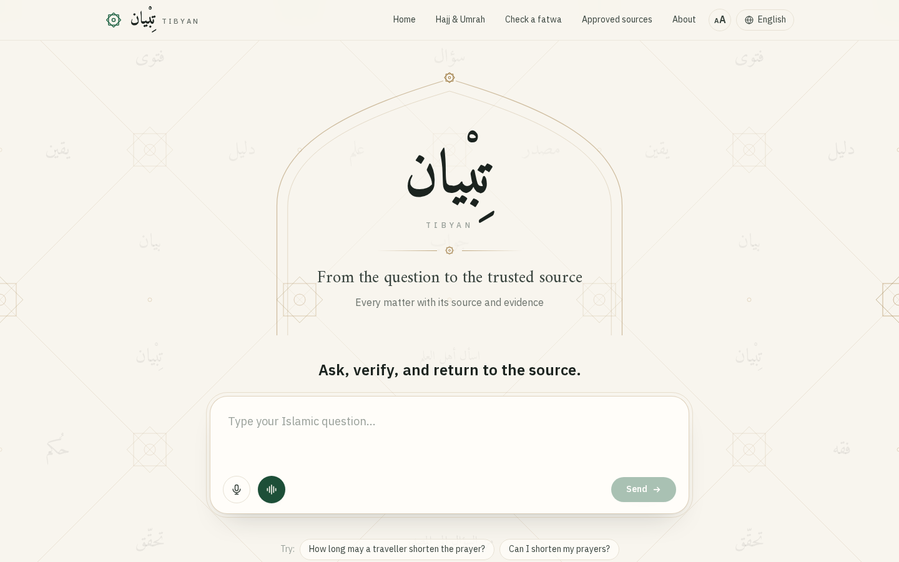          |

<p align="center">
  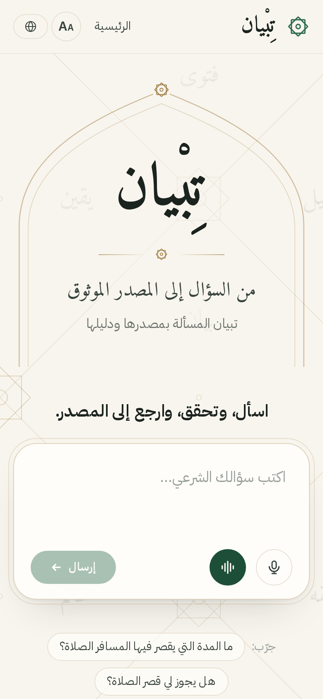
  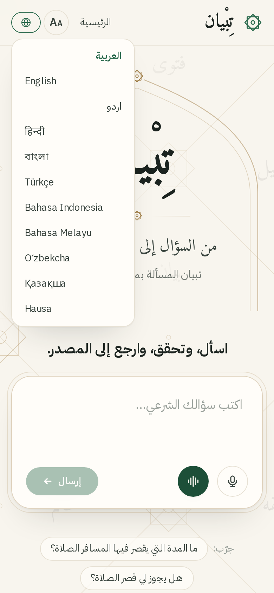
  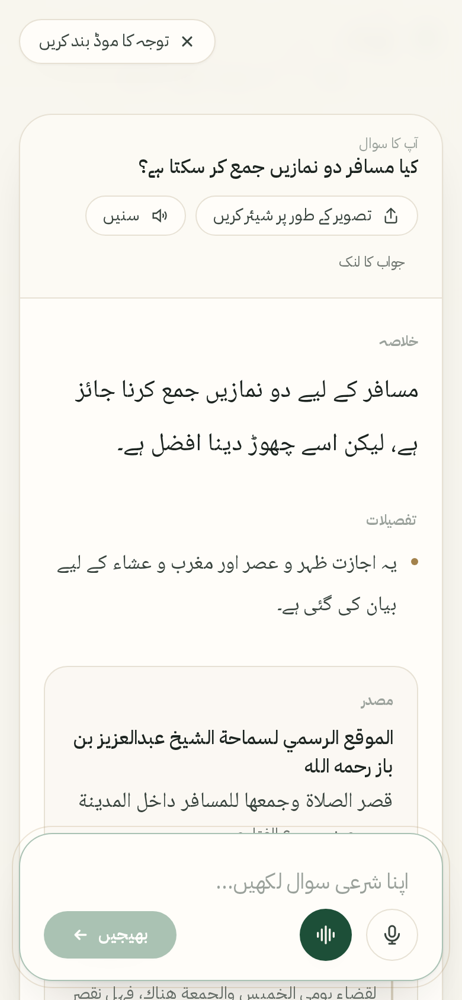
</p>

## المصادر المعتمدة

السجل في [`data/sources/registry.yaml`](data/sources/registry.yaml) هو **القائمة البيضاء**: لكل مصدر حالة
(`approved` أو `pending` أو `blocked`) وأساس اعتماده. استعلام البحث لا يقرأ إلا المصادر المعتمدة، ومصدر معلّق أو
محظور لا يصل إلى أي إجابة (مغطى باختبار). وعند تعارض الفتاوى تُقدَّم الأعلى أولوية.

| الأولوية | المصدر                                                               | طريقة الإدراج                | المفهرس           |
| :------: | -------------------------------------------------------------------- | ---------------------------- | ----------------- |
|    1     | الموقع الرسمي لسماحة الشيخ عبدالعزيز بن باز — binbaz.org.sa          | لقطات حرفية مفهرسة           | أكثر من 2,000     |
|    2     | الموقع الرسمي للشيخ محمد بن صالح العثيمين — binothaimeen.net         | لقطات حرفية مفهرسة           | أكثر من 1,000     |
|    3     | موسوعة الأحاديث النبوية — hadeethenc.com                             | لقطات حرفية مفهرسة           | 500 حديث مشروح    |
|    4     | دار الإفتاء المصرية · دائرة الإفتاء الأردنية · إدارة الإفتاء بالكويت | بحث مباشر عند عدم وجود إجابة | تُفهرس عند الحاجة |

كل لقطة محفوظة بنصها الحرفي مع الرابط ووقت الجلب وبصمة SHA-256، والفهرسة ترفض أي لقطة معدّلة. **نصوص الفتاوى ملك
لناشريها فلا ينشرها هذا المستودع**؛ فيه قائمتها فقط ([`data/corpus/manifest.jsonl`](data/corpus/manifest.jsonl):
المصدر والرقم والرابط والبصمة)، وتُنزَّل من مواقعها الأصلية عند التشغيل ([`data/README.md`](data/README.md)).

## كيف يعمل

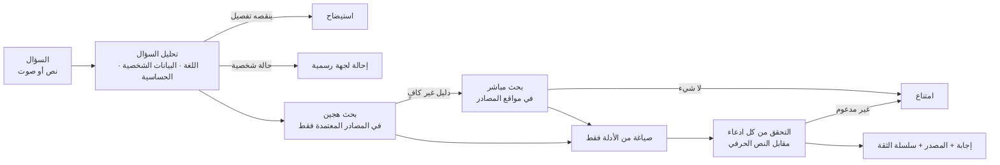

- **النموذج اللغوي ليس مصدرًا.** لا يُستدعى إلا بعد العثور على دليل كافٍ، ويستلم الأدلة كبيانات محددة، ويعيد
  ادعاءات بصيغة JSON صارمة لكل منها اقتباس من كلام الشيخ. أي ادعاء ليس اقتباسه في الدليل، أو يخالفه حسب فاحص
  استلزام مستقل، يُحذف؛ وإن لم يصمد الملخص يمتنع تبيان.
- **الاستخراج أولًا:** إذا وُجدت جملة من الفتوى نفسها تجيب عن السؤال وتجاوزت التحقق، تُعرض كما هي بلا أي تكلفة
  للنموذج. والنموذج يُستخدم فقط عند الحاجة، مع ذاكرة مؤقتة وسقف يومي للتكلفة.
- **البحث الهجين:** متجهات `multilingual-e5-large` (1024 بُعدًا، فهرس HNSW) مع بحث نصي على جذوع عربية مطبّعة،
  ثم دمج وترتيب. والفتوى تبقى وحدة واحدة قدر الإمكان، ونصها حرفي دائمًا.
- **سلسلة الثقة:** كل مرحلة تُوقّت وتُحفظ، وتعرضها الواجهة: سؤالك ← تحليل السؤال ← المصادر ← الأدلة ← الادعاءات ←
  التحقق ← الإجابة.

تفاصيل أكثر: [`ARCHITECTURE.md`](ARCHITECTURE.md) · [`docs/features.md`](docs/features.md) ·
[`docs/LLM_COST.md`](docs/LLM_COST.md)

## البنية التقنية

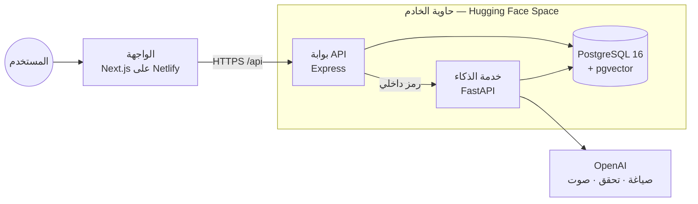

| الجزء                | التقنيات                                                                                 |
| -------------------- | ---------------------------------------------------------------------------------------- |
| `apps/web`           | Next.js 16 · React 19 · TypeScript · Tailwind CSS 4 · 11 لغة (RTL/LTR)                   |
| `apps/api`           | Express 5 · TypeScript · zod · pino · تحديد المعدل · جلسات مجهولة · سجل تدقيق            |
| `services/ai`        | Python 3.12 · FastAPI · psycopg 3 · pgvector · fastembed (e5-large) · OpenAI / Anthropic |
| `packages/contracts` | أنواع العقد المشتركة بين الواجهة والـAPI وخدمة الذكاء                                    |
| `db/migrations`      | مخطط قاعدة البيانات بملفات SQL مرقّمة                                                    |

### هيكل المستودع

```text
tibyan/
├── apps/
│   ├── web/                 # الواجهة (Next.js) + اختبارات Playwright في e2e/
│   └── api/                 # بوابة الـAPI (Express)
├── services/ai/             # خدمة الذكاء: الفهم، البحث، الصياغة، التحقق، الصوت
├── packages/contracts/      # الأنواع المشتركة
├── db/migrations/           # مخطط قاعدة البيانات
├── data/
│   ├── sources/registry.yaml   # القائمة البيضاء للمصادر وأولوياتها
│   ├── escalation/bodies.yaml  # الجهات الرسمية للإحالة
│   ├── corpus/                 # لقطات الفتاوى الحرفية
│   └── eval/                   # أسئلة التقييم
├── deploy/
│   ├── backend/             # حاوية الخادم الكاملة (Hugging Face Space)
│   └── netlify/             # إعداد بناء الواجهة على Netlify
├── scripts/                 # أدوات التشغيل والتقييم وتجهيز النشر
├── docker-compose.yml       # التشغيل المحلي الكامل بأمر واحد
└── .env.example             # كل متغيرات البيئة موثقة (بلا قيم سرية)
```

## التشغيل محليًا

المتطلب الوحيد: **Docker Desktop** (أو Docker Engine مع Compose v2).

</div>

```bash
git clone https://github.com/Fahahd00/tibyan.git
cd tibyan
cp .env.example .env       # يعمل كما هو؛ أضف مفاتيحك اختياريًا (انظر الجدول أدناه)
docker compose up --build
```

<div dir="rtl">

ثم افتح **http://localhost:3000** (العربية على `/ar`، والإنجليزية على `/en`).

يشغّل `docker compose up` الخدمات بالترتيب:

1. `db` — PostgreSQL 16 مع pgvector (متاح على `127.0.0.1` فقط).
2. `migrate` — يطبّق ملفات `db/migrations`.
3. `seed` — ينزّل نصوص الفتاوى من مواقعها الأصلية حسب القائمة، ثم يسجّل المصادر والجهات الرسمية ويفهرس النصوص.
   **أول تشغيل يستغرق قرابة ساعة**: تنزيل النصوص بمعدل طلب واحد في الثانية احترامًا للمواقع، ونموذج الفهرسة
   (قرابة 2.2 GB). والتشغيلات التالية تتخطى ذلك.
4. `ai` — خدمة الذكاء على `127.0.0.1:8000`.
5. `api` — بوابة الـAPI على `:4000`.
6. `web` — الواجهة على `:3000`.

**بلا أي مفتاح** يعمل تبيان في الوضع الاستخراجي: يعرض جملًا حرفية من الفتوى المعتمدة. وبإضافة مفتاح OpenAI
تُفعَّل الصياغة الموثقة والصوت والبحث المباشر. لوحة الحوكمة على `/ar/admin` وتعمل بعد ضبط `ADMIN_TOKEN`.

</div>

```bash
docker compose ps                  # حالة الخدمات
docker compose logs -f ai          # سجل خدمة الذكاء
docker compose run --rm seed       # إعادة الفهرسة (آمنة للتكرار)
docker compose down                # إيقاف مع الاحتفاظ بالبيانات (أضف -v للمسح)
```

<div dir="rtl">

### متغيرات البيئة

كل المتغيرات موثقة في [`.env.example`](.env.example). أهمها:

| المتغير                           | الافتراضي               | الغرض                                                        |
| --------------------------------- | ----------------------- | ------------------------------------------------------------ |
| `OPENAI_API_KEY` / `OPENAI_MODEL` | فارغ                    | الصياغة والتحقق بنموذج OpenAI (نستخدم `gpt-5.4-mini`)        |
| `ANTHROPIC_API_KEY`               | فارغ                    | بديل بنموذج Claude                                           |
| `LLM_PROVIDER`                    | `auto`                  | `auto` أو `openai` أو `anthropic` أو `none` (استخراجي فقط)   |
| `TTS_PROVIDER` / `STT_PROVIDER`   | `browser`               | `openai` لصوت الخادم، أو صوت المتصفح                         |
| `LIVE_SEARCH`                     | `true`                  | البحث المباشر في مواقع المصادر المعتمدة (يتطلب مفتاح OpenAI) |
| `LLM_DAILY_BUDGET_USD`            | `5`                     | سقف يومي للتكلفة؛ بعده تصبح الإجابات استخراجية               |
| `ADMIN_TOKEN`                     | فارغ (اللوحة معطّلة)    | رمز الدخول للوحة الحوكمة                                     |
| `INTERNAL_API_TOKEN`              | —                       | سر مشترك بين الـAPI وخدمة الذكاء (إلزامي في الإنتاج)         |
| `CORS_ORIGINS`                    | `http://localhost:3000` | النطاقات المسموح لها بالاتصال المباشر بالـAPI                |
| `NEXT_PUBLIC_API_BASE`            | فارغ                    | رابط الـAPI إذا استُضيفت الواجهة منفصلة عنه                  |

**المفاتيح توضع في `.env` فقط**، والملف مستبعد من Git. الاختبارات وCI لا تحتاج أي مفتاح حقيقي.

## النشر

النسخة المنشورة تتكون من جزأين:

| الجزء                          | المنصة                    | ملفات التشغيل                                                                                                         |
| ------------------------------ | ------------------------- | --------------------------------------------------------------------------------------------------------------------- |
| الواجهة                        | Netlify                   | [`deploy/netlify/netlify.toml`](deploy/netlify/netlify.toml) · [`scripts/stage-netlify.sh`](scripts/stage-netlify.sh) |
| الخادم: API + الذكاء + القاعدة | Hugging Face Docker Space | [`deploy/backend/`](deploy/backend) · [`scripts/stage-backend.sh`](scripts/stage-backend.sh)                          |

- **حاوية الخادم** ([`deploy/backend/Dockerfile`](deploy/backend/Dockerfile)) تجمع PostgreSQL مع pgvector، وخدمة
  الذكاء، والـAPI في حاوية واحدة، ونموذج الفهرسة مدمج فيها. **نصوص الفتاوى ليست في الصورة ولا في ملفات الـSpace
  العامة**: [`start.sh`](deploy/backend/start.sh) يستعيد الفهرس عند التشغيل من مستودع بيانات **خاص** على Hugging
  Face برمز سري، ثم يشغّل خدمة الذكاء، ولا يفتح الـAPI إلا بعد جاهزيتها.
- **الواجهة** تتصل بالخادم مباشرة عبر `NEXT_PUBLIC_API_BASE`، حتى لا تنقطع الإجابات الطويلة بمهلة وسيط.
- **الأسرار** (مفتاح OpenAI، ورمز المشرف، والرمز الداخلي) تُضبط أسرارًا في الـSpace، ولا تدخل الصورة ولا المستودع.

</div>

```bash
# الخادم: مجلد الـSpace (الكود) ونسخة الفهرس (ملف منفصل يُرفع لمستودع خاص)، ثم الرفع وضبط الأسرار من .env
sh scripts/stage-backend.sh ~/tibyan-backend          # ينتج ~/tibyan-backend و ~/tibyan-backend.dump
python deploy/backend/push.py ~/tibyan-backend ~/tibyan-backend.dump "https://<your-site>"

# الواجهة: تجهيز مجلد نظيف (بلا .env) ورفعه إلى Netlify
sh scripts/stage-netlify.sh ~/tibyan-web
```

<div dir="rtl">

## الاختبارات والجودة

| المجموعة          | الأمر                                        | ماذا تغطي                                                                                             |
| ----------------- | -------------------------------------------- | ----------------------------------------------------------------------------------------------------- |
| خدمة الذكاء       | `npm run ai:test`                            | التطبيع العربي، كشف اللغة، البيانات الشخصية، التصنيف، البحث، الصياغة، التحقق، بوابة الأمان، المزودات  |
| تكامل خدمة الذكاء | `TIBYAN_TEST_DATABASE_URL=… npm run ai:test` | المسار كاملًا على PostgreSQL حقيقية: إجابة، استيضاح، إحالة، امتناع، استبعاد المصادر المعلّقة          |
| الـAPI            | `npm test -w @tibyan/api`                    | التحقق من المدخلات، الجلسات، التدقيق، صلاحيات المشرف، الصوت لا يقبل إلا معرّف إجابة محفوظة            |
| واجهة كاملة (E2E) | `npm run e2e -w @tibyan/web`                 | السيناريوهات الأساسية، اللغات، الصوت، التحقق من الفتوى، ضيوف الرحمن، المشاركة، الوضع الميسّر، الحوكمة |
| التقييم           | `npm run eval`                               | النتيجة المتوقعة لكل سؤال، ومؤشر «ادعاءات غير مدعومة ظهرت للمستخدم»                                   |

**آخر النتائج:** اختبارات خدمة الذكاء 225 ناجحة، والـAPI 11 ناجحة، والواجهة الكاملة 29 من 29، والتنسيق والتدقيق
وفحص الأنواع نظيفة، وCI يشغّلها على كل دفع. وجُرّب الموقع المنشور من متصفح: سؤال حقيقي بإجابة موثقة خلال ثوانٍ،
والصوت، والتحقق من الفتوى، ولوحة الحوكمة.

**لا ندّعي دقة 100% ولا «صفر هلوسة».** ما تثبته الاختبارات أضيق من ذلك: في كل الحالات المختبرة لم تظهر للمستخدم
ادعاءات غير مدعومة بالدليل المسترجع. التقييم الدلالي على 219 سؤالًا معاد الصياغة منشور بأرقامه في
[`docs/SEMANTIC_EVALUATION.md`](docs/SEMANTIC_EVALUATION.md)، والتقييم المستقل من مختصين شرعيين على خارطة الطريق.

## الأمان والخصوصية

- **لا أسرار في المستودع:** `.env` مستبعد، و`.env.example` بلا قيم حقيقية، والمفاتيح تُقرأ من البيئة فقط. كلمة
  مرور PostgreSQL في `docker-compose.yml` افتراضية للتشغيل المحلي فقط، والقاعدة لا تُتاح إلا على `127.0.0.1`.
- **لا بيانات مستفيدين:** المستودع لا يحوي أسئلة الزوار ولا سجلاتهم. البيانات الشخصية في الأسئلة (أسماء، أرقام،
  بريد…) تُحجب قبل التخزين، وعنوان IP لا يُحفظ إلا مُجزّأً (hash) بملح سري، والجلسات مجهولة بلا هوية.
- **الحماية:** تحديد معدل الطلبات، وقائمة CORS مغلقة، ورمز داخلي بين الخدمات، ورمز للوحة الحوكمة، وسجل تدقيق لكل
  إجراء إداري. أخطاء المزودات لا تظهر للمستخدم، والسجلات لا تحفظ المفاتيح ولا نصوص الطلبات.
- **حقوق المصادر:** نصوص الفتاوى والأحاديث لا تُنشر في المستودع ولا في ملفات الخادم العامة، بل تُنزَّل من مواقعها
  الأصلية، ونسخة الفهرس المنشورة في مستودع خاص.
- **النص المسترجع بيانات لا أوامر:** يُعزل ويُنظّف، وأي ادعاء يُطابق به؛ فتعليمات مدسوسة في مصدر لا تنتج ادعاءً
  غير موثق (مغطى باختبار).

راجع [`SECURITY.md`](SECURITY.md) للإبلاغ عن الثغرات.

## حدود معروفة

- لم يُجرَ بعدُ تقييم مستقل للدقة من مختصين شرعيين.
- إذن إعادة استخدام محتوى المواقع المفهرسة قيد الطلب من أصحابها (والتواصل جارٍ مع مؤسسة الشيخ ابن عثيمين).
- فُهرس 500 حديث من 931 لقطة في موسوعة الأحاديث، والباقي جاهز للفهرسة.
- في النسخة المنشورة تُمسح الأسئلة المحفوظة عند إعادة تشغيل الخادم؛ أما الفهرس والمصادر فثابتة.

القائمة الكاملة: [`KNOWN_ISSUES.md`](KNOWN_ISSUES.md) · المساهمة وسير العمل: [`CONTRIBUTING.md`](CONTRIBUTING.md)

</div>

<a id="dev-history"></a>

<div dir="rtl">

## سجل التطوير

إفصاحًا عن العمل السابق لفترة التحدي (المسموح به بشرط توثيقه قبل 4 أكتوبر 2026 والإفصاح عنه)، وتاريخه الكامل
بالـcommits منشور في المستودع الأصلي للفريق [Ya-az/tibyan](https://github.com/Ya-az/tibyan/commits):

| المرحلة                              | التاريخ (الرياض)          | المحتوى                                                                                                                                                                                                                                                                                                                                                                                                                                     |
| ------------------------------------ | ------------------------- | ------------------------------------------------------------------------------------------------------------------------------------------------------------------------------------------------------------------------------------------------------------------------------------------------------------------------------------------------------------------------------------------------------------------------------------------- |
| **النسخة الأولية** (قبل فترة التحدي) | 3 أكتوبر 2026 (37 commit) | المستودع والأدوات، مخطط قاعدة البيانات، سجل المصادر والفهرسة الحرفية والبحث الهجين، مسار السؤال مع التحقق من الاستشهاد وبوابة الأمان، بوابة الـAPI مع الجلسات والتدقيق والحوكمة، واجهة عربية وإنجليزية مع سلسلة الثقة والصوت عبر المتصفح، Docker وCI، مزودا Claude وOpenAI، التقييم الدلالي، ونموذج e5-large                                                                                                                                |
| **خلال فترة التحدي**                 | من 4 أكتوبر 2026          | معيار إعادة الصياغة وضبط وزن البحث، الاستخراج أولًا مع الذاكرة المؤقتة وسقوف التكلفة، 9 لغات إضافية (11 لغة)، التحقق من الفتاوى المتداولة، صفحة ضيوف الرحمن، الوضع الميسّر، بطاقة المشاركة مع QR، البحث المباشر وجهات الإفتاء الاحتياطية وأولوية المصادر، موسوعة الأحاديث، الصوت عبر OpenAI والمحادثة الصوتية، لوحة الحوكمة الموسّعة، إعادة التصميم، النشر (Netlify وHugging Face والنطاق)، فصل نصوص المصادر عن المستودع، والفيديو التعريفي |

وأدوات الذكاء الاصطناعي المستخدمة في التطوير مُفصَح عنها في [`docs/COMPONENTS.md`](docs/COMPONENTS.md).

</div>

---

## English summary

**Tibyan** is a trust layer between a question and approved Islamic sources — not a chatbot that issues rulings.
It understands a question in 11 languages (text or voice), searches an **approved-source whitelist** only (Ibn Baz,
Ibn Uthaymeen, HadeethEnc, then official fatwa bodies via live search), quotes the **verbatim** source with its link,
and verifies every claim against that text before showing it. No sufficient evidence → **abstain**; personal case →
**escalate** to verified official bodies; missing detail → **ask**. It also checks forwarded quotes attributed to
scholars, offers a pilgrims' page, an easy mode for elderly users, shareable answer cards with a QR code, and a
governance console (source approval, re-indexing, audit log, content gaps).

- **Live demo:** https://tibyan-rain.abrdns.com
- **Stack:** Next.js 16 · Express 5 · FastAPI · PostgreSQL 16 + pgvector · multilingual-e5-large · OpenAI
- **Run locally:** `cp .env.example .env && docker compose up --build` → http://localhost:3000
- **Deploy:** web on Netlify ([`deploy/netlify`](deploy/netlify)), backend as one Docker container on a Hugging Face
  Space ([`deploy/backend`](deploy/backend))

<sub>المحتوى الذي يعرضه تبيان منقول من مصادره مع نسبته وروابطه، ولا يغني عن سؤال أهل العلم في الحالات الشخصية. ·
Content is quoted from its sources with attribution; it is no substitute for consulting qualified scholars on
personal cases.</sub>

---

<a id="docs"></a>

<div dir="rtl">

## توثيق الإعداد والتشغيل والمصادر والأدوات والتراخيص

### 1. الإعداد

| المتطلب                         | التفاصيل                                                               |
| ------------------------------- | ---------------------------------------------------------------------- |
| Docker Desktop أو Docker Engine | مع Compose v2، وهو المتطلب الوحيد للتشغيل المحلي                       |
| الموارد                         | يُنصح بذاكرة 8 GB، وقرابة 10 GB من القرص للصور ونموذج الفهرسة والقاعدة |
| Node.js 22 و Python 3.12        | للتطوير بدون Docker فقط                                                |
| مفتاح OpenAI                    | اختياري: بدونه يعمل تبيان في الوضع الاستخراجي (نصوص حرفية من الفتاوى)  |

خطوات الإعداد:

1. انسخ ملف البيئة: `cp .env.example .env` — كل متغير فيه موثّق بتعليق.
2. **اختياري:** ضع `OPENAI_API_KEY` و`OPENAI_MODEL` لتفعيل الصياغة والتحقق بالنموذج والصوت والبحث المباشر.
3. **للوحة الحوكمة:** ضع `ADMIN_TOKEN` برمز من اختيارك.
4. **للإنتاج:** ضع `APP_ENV=production` و`INTERNAL_API_TOKEN` عشوائيًا (مثلًا ناتج `openssl rand -hex 32`)،
   و`CORS_ORIGINS` بنطاق الواجهة.
5. ملف `.env` مستبعد من Git ولا يُرفع أبدًا؛ في الاستضافة تُضبط القيم أسرارًا في المنصة.

### 2. التشغيل

| الطريقة                      | الأمر                                                        | التفاصيل                             |
| ---------------------------- | ------------------------------------------------------------ | ------------------------------------ |
| كامل بأمر واحد (Docker)      | `docker compose up --build`                                  | [التشغيل محليًا](#التشغيل-محليًا)    |
| تطوير مع إعادة تحميل تلقائية | `npm install` ثم `npm run dev` (بعد `db:migrate` و`db:seed`) | [`CONTRIBUTING.md`](CONTRIBUTING.md) |
| الإنتاج                      | الواجهة على Netlify، والخادم حاوية على Hugging Face          | [النشر](#النشر)                      |
| سؤال من الطرفية              | `node scripts/py.mjs -m tibyan_ai.cli ask "سؤالك" --trace`   | يعرض مراحل المسار كاملة              |
| إعادة الفهرسة                | `npm run db:reindex`                                         | بعد تغيير نموذج الفهرسة              |
| التقييم                      | `npm run eval`                                               | النتيجة المتوقعة لكل سؤال تقييم      |

ملفات التشغيل: [`docker-compose.yml`](docker-compose.yml) · [`apps/web/Dockerfile`](apps/web/Dockerfile) ·
[`apps/api/Dockerfile`](apps/api/Dockerfile) · [`services/ai/Dockerfile`](services/ai/Dockerfile) ·
[`deploy/backend/`](deploy/backend) · [`deploy/netlify/netlify.toml`](deploy/netlify/netlify.toml) ·
[`scripts/`](scripts) · [`.github/workflows/ci.yml`](.github/workflows/ci.yml)

### 3. المصادر

**مصادر المحتوى الشرعي** (تفصيلها في [`data/sources/registry.yaml`](data/sources/registry.yaml)):

| المصدر                                                | الرابط                                              | طريقة الاستخدام                            |
| ----------------------------------------------------- | --------------------------------------------------- | ------------------------------------------ |
| الموقع الرسمي لسماحة الشيخ عبدالعزيز بن باز رحمه الله | [binbaz.org.sa](https://binbaz.org.sa)              | لقطات حرفية مفهرسة، مع الرابط والبصمة      |
| الموقع الرسمي للشيخ محمد بن صالح العثيمين رحمه الله   | [binothaimeen.net](https://binothaimeen.net)        | لقطات حرفية مفهرسة، مع الرابط والبصمة      |
| موسوعة الأحاديث النبوية                               | [hadeethenc.com](https://hadeethenc.com/ar)         | عبر واجهتها البرمجية العامة، نصًا حرفيًا   |
| دار الإفتاء المصرية                                   | [dar-alifta.org](https://www.dar-alifta.org/ar)     | بحث مباشر عند عدم وجود إجابة               |
| دائرة الإفتاء العام — الأردن                          | [aliftaa.jo](https://aliftaa.jo)                    | بحث مباشر عند عدم وجود إجابة               |
| إدارة الإفتاء — وزارة الأوقاف بالكويت                 | [eftaa.awqaf.gov.kw](https://eftaa.awqaf.gov.kw/ar) | بحث مباشر عند عدم وجود إجابة               |
| الرئاسة العامة للبحوث العلمية والإفتاء                | [alifta.gov.sa](https://www.alifta.gov.sa)          | معلّق (`pending`) — لا يُستخدم في الإجابات |

**جهات الإحالة الرسمية** ([`data/escalation/bodies.yaml`](data/escalation/bodies.yaml)): وزارة العدل
([moj.gov.sa](https://www.moj.gov.sa))، ومنصة ناجز ([najiz.sa](https://najiz.sa))، والرئاسة العامة للبحوث العلمية
والإفتاء — مع طريقة التحقق من كل جهة وتاريخه.

**بيانات التقييم** ([`data/eval/`](data/eval)): أسئلة كتبها الفريق للاختبار، وليست أسئلة مستخدمين.

**نصوص المصادر لا تُنشر هنا**: المستودع فيه قائمتها فقط ([`data/corpus/manifest.jsonl`](data/corpus/manifest.jsonl))،
وأمر `fetch-corpus` ينزّلها من مواقعها الأصلية. وتاريخ أول استخدام كل مصدر وأساسه في
[`docs/COMPONENTS.md`](docs/COMPONENTS.md).

### 4. الأدوات

| المجال           | الأداة                                                                             | الإصدار | الرخصة             |
| ---------------- | ---------------------------------------------------------------------------------- | ------- | ------------------ |
| الواجهة          | Next.js                                                                            | 16.3    | MIT                |
|                  | React / React DOM                                                                  | 19.3    | MIT                |
|                  | Tailwind CSS                                                                       | 4.3     | MIT                |
|                  | uqr (رموز QR)                                                                      | —       | MIT                |
| بوابة الـAPI     | Express                                                                            | 5.2     | MIT                |
|                  | zod · pino · helmet · express-rate-limit · multer · pg                             | —       | MIT                |
| خدمة الذكاء      | FastAPI                                                                            | 0.142   | MIT                |
|                  | Uvicorn                                                                            | 0.54    | BSD-3-Clause       |
|                  | Pydantic                                                                           | 2.13    | MIT                |
|                  | psycopg 3 + psycopg-pool                                                           | 3.3     | LGPL-3.0           |
|                  | pgvector (Python)                                                                  | 0.5     | MIT                |
|                  | fastembed                                                                          | 0.8     | Apache-2.0         |
|                  | ONNX Runtime                                                                       | 1.30    | MIT                |
|                  | NumPy                                                                              | 2.5     | BSD-3-Clause       |
|                  | httpx                                                                              | 0.28    | BSD-3-Clause       |
|                  | Beautiful Soup 4 · PyYAML                                                          | —       | MIT                |
|                  | OpenAI Python SDK                                                                  | 3.24    | Apache-2.0         |
|                  | Anthropic Python SDK                                                               | 1.11    | MIT                |
| قاعدة البيانات   | PostgreSQL                                                                         | 16      | PostgreSQL License |
|                  | pgvector (امتداد PostgreSQL)                                                       | —       | PostgreSQL License |
| نموذج الفهرسة    | intfloat/multilingual-e5-large                                                     | —       | MIT                |
| الخطوط           | Amiri · IBM Plex Sans Arabic · Noto Naskh Arabic · Noto Sans (Devanagari, Bengali) | —       | SIL OFL 1.1        |
| الاختبار والجودة | Playwright                                                                         | 1.63    | Apache-2.0         |
|                  | Vitest · Supertest · ESLint · Prettier · Husky                                     | —       | MIT                |
|                  | pytest · Ruff                                                                      | —       | MIT                |
|                  | TypeScript                                                                         | 5.9     | Apache-2.0         |

**الخدمات الخارجية** (تُستخدم بشروط استخدام مزوّدها، لا برخصة):

| الخدمة              | الاستخدام                                                                                               |
| ------------------- | ------------------------------------------------------------------------------------------------------- |
| OpenAI API          | `gpt-5.4-mini` للصياغة والتحقق، و`gpt-4o-mini-tts` للصوت، والبحث المباشر في نطاقات المصادر المعتمدة فقط |
| Netlify             | استضافة الواجهة                                                                                         |
| Hugging Face Spaces | استضافة حاوية الخادم                                                                                    |
| ClouDNS             | النطاق وإدارة DNS                                                                                       |
| GitHub              | المستودع وCI                                                                                            |

**أدوات التطوير بالذكاء الاصطناعي** (إفصاح): استُخدم **Claude Code** من Anthropic مساعدًا برمجيًا في كتابة الكود
والاختبارات والتوثيق وإعداد النشر وإنتاج الفيديو التعريفي، بتوجيه الفريق ومراجعته؛ والتعليق الصوتي في الفيديو مولّد
بأداة ElevenLabs. السجل الكامل لكل مصدر وأداة ونموذج وخدمة، بتاريخ أول استخدام وأساسه أو رخصته:
[`docs/COMPONENTS.md`](docs/COMPONENTS.md).

### 5. التراخيص

- **كود تبيان:** جميع الحقوق محفوظة لفريق RAIN © 2026. الكود منشور للاطلاع والتقييم، ولا يُسمح بنسخه أو تعديله أو
  إعادة استخدامه إلا بإذن مكتوب من الفريق، **مع حفظ الرخص الممنوحة للجهة المنظمة بموجب شروط التحدي** (رخصة الاستلام
  والتقييم، والرخصة الموسّعة للمشاريع المختارة) — انظر [`LICENSE`](LICENSE).
- **مكوّنات الطرف الثالث:** تبقى كل مكتبة وخط ونموذج تحت رخصته المذكورة في الجدول أعلاه. كلها رخص متساهلة (MIT،
  Apache-2.0، BSD-3-Clause، PostgreSQL License، SIL OFL 1.1)، عدا psycopg بترخيص LGPL-3.0، ويُستخدم مكتبةً كما هي
  دون تعديل.
- **محتوى المصادر:** نصوص الفتاوى والأحاديث ملك لناشريها، ولا تشملها رخصة المشروع ولا تُنشر في هذا المستودع. تعرضها
  المنصة مقتبسة بنصها الحرفي مع النسبة والرابط لكل نص، وإذن إعادة الاستخدام قيد الطلب من أصحاب المواقع قبل أي إطلاق
  عام.

</div>
